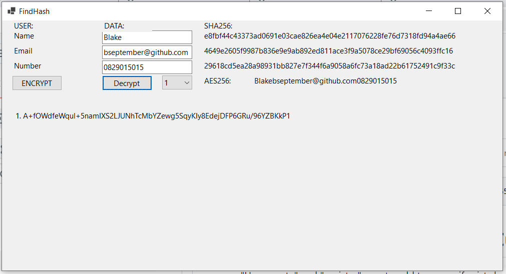

# FindHash

Add user details in textbox to get the irreversible encrypted sha256 generated in the third column. 

Clicking encrypt will concatenate the textbox values and generate a reversible AES256 encrypted text.

Decrypt will decrypt the value generated from clicking the encrypt button, select which value in the list you want decrypted.

### Clone :
```shell
git clone https://github.com/bseptember/findme

cd findme
```

### Quick Start
```run executable

..\findhash\bin\Debug\net6.0-windows\findhash.exe

```

### Visual Studio:
```Run
Click the run button in visual studio after opening it.
```

### Build with docker
```Dockerfile

docker build -t findhash .

docker run -d --name myapp findhash

The output executable will be generated in /app/out
```

### Test:
#### Sample

